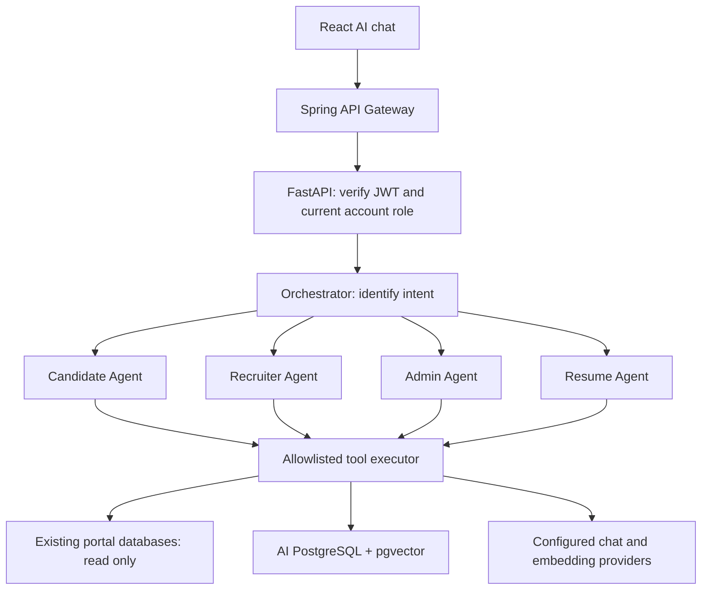

# Design and integration contracts

## Request flow

The orchestrator uses a forced `route_request` function call with an enum restricted to the user's role agent or the resume agent. The selected agent gets only the tools allowed for that role. The first specialist completion must call a tool. Tool arguments are validated with Pydantic and each call is authorized again server-side. Results go back to the model as tool messages; the final answer and retrieved evidence form one response.

General multi-intent requests go to the role agent, whose tools also include authorized resume summaries/matching. Resume extraction is a structured extraction task; the resume specialist also handles chat about stored resume facts. No agent delegates permissions to another agent.

## Access rules

| Operation | Candidate | Recruiter | Admin |
|---|---|---|---|
| Open-job search / job details | Yes | Yes | Yes |
| Candidate application status | Own only | No | Through admin monitor |
| Semantic recommendations | Own profile or supplied skills | No | No |
| Upload resume | Own only | No | No |
| Profile / resume summary | Own only | Applicant to an owned job; job ID required | Yes |
| Match a candidate to a job | Own only | Applicant to an owned job | Yes |
| Application statistics | No | Owned jobs only | Platform analytics |
| Rank applicants | No | Owned jobs only | Any job |
| Platform report / record monitor | No | No | Yes |
| Refresh job vectors | No | No | Yes / operator CLI |
| Read/delete conversation | Owner and current role for reads | Same | Same; admin cannot read others' conversations |

The UI does not send identity or role fields. FastAPI verifies the existing signed JWT and checks its email, user ID and role against the current `user_credential` record. It accepts the original `jwt` cookie or a bearer token. JWT expiration is mandatory. Browser cookie POSTs with an Origin are checked against `ALLOWED_ORIGINS`; cross-site fetch requests are rejected. Database queries are fixed and parameterized; the model cannot execute SQL or fetch arbitrary URLs.

## Existing database mapping

| Java entity | Tables read | Key fields |
|---|---|---|
| UserCredential | `user_credential` | `user_id`, `email`, `role`, `creation_date` |
| Job | `job`, `job_skills` | `job_id`, `posted_by`, `status`, `experience_required`, `skill` |
| Application | `application` | `application_id`, `job_id`, `candidate_email`, `status`, `applied_at` |
| CandidateProfile / UserProfile | `user_profile`, `candidate_profile`, `candidate_profile_skills` | `profile_id`, `email`, `full_name`, `experience`, `skills` |

Mappings follow the uploaded JPA entities and Spring's snake-case physical naming. `PROFILE_SKILLS_FK` accommodates a different implicit join-column name. No password hashes, contact addresses, phone numbers, birth dates or gender fields are selected.

Direct database reading was chosen to satisfy live SQL function calling while preserving your four existing data stores. It couples this service to their schema. A larger deployment could replace `PortalRepository` with internal API adapters or approved reporting views.

## AI-owned records

- `ai_job_vector`: job ID, requirements hash, embedding model signature, vector, update time. Cosine HNSW index. Only public job requirements are embedded.
- `ai_resume`: candidate email, validated extracted JSON, update time. No raw uploaded files.
- `ai_conversation`: UUID, owner email, role, last 12 user/assistant messages, update time. Tool payloads and provider reasoning are not persisted.

Resume skills/experience are used for deterministic candidate matching. pgvector powers semantic job recommendations. Resume vectors are not needed for the transparent matching formula and are not stored.

## Scoring

`100 × (0.8 × matched_required_skills / required_skills + 0.2 × min(candidate_years / required_years, 1))`

Names of skills are trimmed, lowercased and whitespace-normalized. The current implementation does not map synonyms. When no skills are required, skill coverage is 1. When no experience is required, experience coverage is 1. Unknown experience counts as 0 if the job requires experience. Parsed resume experience takes precedence over profile experience when present. Skills are combined from the resume and profile. Results include matched/missing skills and source availability.

Scores are reproducible guidance, not validated hiring probabilities. Ranking excludes withdrawn applications, operates on up to 100 applications per page, and clearly labels its page scope. Human review is required; no status is changed.

## Failure behavior and operating limits

- Provider timeouts are configurable. One retry is used for transient network errors and selected retryable HTTP responses. Authentication denials are not retried.
- Tool loops have a fixed round limit and at most eight tool calls per round.
- Rate limiting is per-user, per-process, 20 AI requests/minute by default. Use one worker for this demo; use a shared limiter and upstream body/request limits when scaling.
- Resume input is limited to 5 MB, 20 PDF pages and 40,000 extracted characters. DOCX expanded archive size is checked. OCR is not included.
- Job indexing is explicit, idempotent by content hash and model, and synchronous. Repeat indexing after changes. Pagination is offset-based, so repeat a full pass if jobs change while indexing.
- Recommendations examine up to 100 vector hits, then reject stale/deleted/closed jobs. They can return fewer results until indexing catches up. Similarity values are not match percentages.
- Platform totals are live independent reads, not a distributed snapshot across four databases.
- Chat history keeps 12 messages and has last-write-wins behavior if the same conversation is submitted concurrently. The supplied UI serializes requests. The client does not supply past assistant or tool messages.
- TLS certificate verification stays enabled for provider calls. Provider credentials are read from environment variables and not returned by APIs.
- Structured request logs record request IDs, route, status and duration; tool logs include only tool name, role and success/error flag. Prompts, resume text, credentials and tool arguments are not logged.
- Custom provider payload compatibility, existing schema and enterprise deployment requirements must be checked in your environment. The code is a working integration implementation, not a claim of a security-audited production system.

## Primary implementation references

- pgvector Python / SQLAlchemy integration: https://github.com/pgvector/pgvector-python
- FastAPI security dependencies: https://fastapi.tiangolo.com/reference/security/
